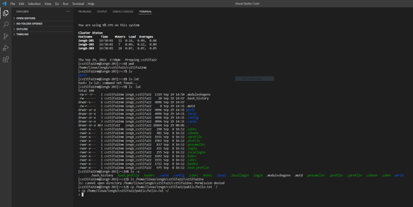

Lab Report Week 1: Remote Access and the Filesystem

1. First step is to download Visual Studio Code, any coding program will work but for this class VSC is used.
below is an image of the program opened

2. Second step is to run a terminal you do this by going on the top and selecting new terminal or by doing Ctrl or Command +.
   Once the terminal is running I used ssh cs15lfa22nm@ieng6.ucsd.edu to connect remotely. If you are following along you will need
   to replace the initials "nm" in my case with the initials given to you through ucsd.
   type password and your logged in remotely
   

3. Once logged in you can try out some command the ones I tried can be seen below

    cd
    ~cd
    ls -lat
    ls -a
    ls <directory> where <directory> is /home/linux/ieng6/cs15lfa22/cs15lfa22abc, where the abc is one of the other group members’ username
    cp /home/linux/ieng6/cs15lfa22/public/hello.txt ~/
    cat /home/linux/ieng6/cs15lfa22/public/hello.txt

4. Moving Files over SSH with scp
for this part of the lab I had a couple errors occur but I was able to get it to work. 
   Reinstalling VCS and making sure you have java installed seemed to fix my issues.
    I created a WhereAmI java class
   
    class WhereAmI {
   
   public static void main(String[] args) {
   
   System.out.println(System.getProperty("os.name"));
   
   System.out.println(System.getProperty("user.name"));
   
   System.out.println(System.getProperty("user.home"));
   
   System.out.println(System.getProperty("user.dir"));
   
   }
   }
   
and then ran it in the terminal 
    using this code:
   

   javac WhereAmI.java

   java WhereAmI

Then, in the directory run the command:

scp WhereAmI.java cs15lfa22zz@ieng6.ucsd.edu:~/

!
   
5.SSH Keys

Creating SSH keys. These help by not having to type your password everytime you log in to you
terminal.

The first step is to run ssh-keygen this generates a public and a private rsa key pair
from there you same the passphase as nothing 
know on the client you run your normal login for remote conectivtiy
ssh cs15lfa22zz@ieng6.ucsd.edu
and enter your password 

now once on the server use the code mkdir.ssh and logout out after using the code exit
Now back on the client you run code to authorize the rsa id 

scp /Users/joe/.ssh/id_rsa.pub cs15lfa22@ieng6.ucsd.edu:~/.ssh/authorized_keys 

Now you are able to log in without a password!! 

