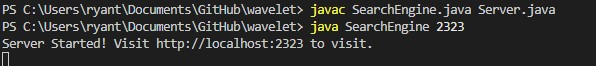
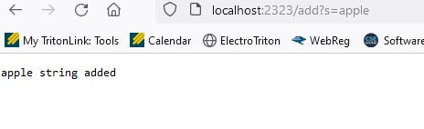
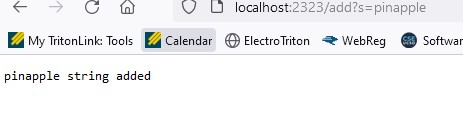
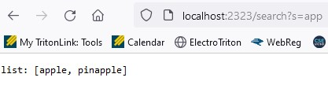

# Week 3 Lab Report
# Part 1

Below is my Simplest Search Engine from week 2 

    ArrayList<String> searches= new ArrayList<String>();
    public String handleRequest(URI url) {
        *
        *
        *
    else {
            System.out.println("Path: " + url.getPath());
            if (url.getPath().contains("/add")) {
                String[] parameters = url.getQuery().split("=");
                if (parameters[0].equals("count")) {
                    num += Integer.parseInt(parameters[1]);
                    return String.format("Number increased by %s! It's now %d", parameters[1], num);
                }
                if(parameters[0].equals("s")){
                    searches.add(parameters[1]);
                    return String.format("%s string added", parameters[1],searches);

                }

                }
            if (url.getPath().contains("/search")) {
                String[] parameters = url.getQuery().split("=");
                if(parameters[0].equals("s")){
                    return String.format("list: "+ searches, parameters[1],searches);
            }
        }

 

### Below is the start up of my code and as you can see it runs. I chose the port 2323 but you can choose any number between 1024 to 49151
\\

\

### Using the command /add and integrating the parameter s your able to add a string to the array created called searches.

### Using the command /search your able to search for anything in the array with the following character in it. 

# Part 2

For the second part of lab, my group and I worked on running tests for the ArrayExamples file. Using the base code given we ran the JUnit test and both passed

This lead me to setup some failure-inducing inputs to test most cases below is an image of the setup for both ReverseInPlace and Reversed commands.

The symptom of the failure inducing input was both tests failing as seen below:

So, once the bug was found in both codes I was able to find a solution with my group and we came up with the following code:

The bug causes that particular symthom because the array was changing the input before it had a chance to reverse the input. Creating a temp array allows the arrays to make changes to the original array without tampering with the temp array. 