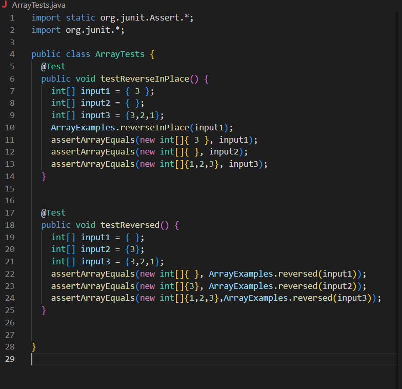
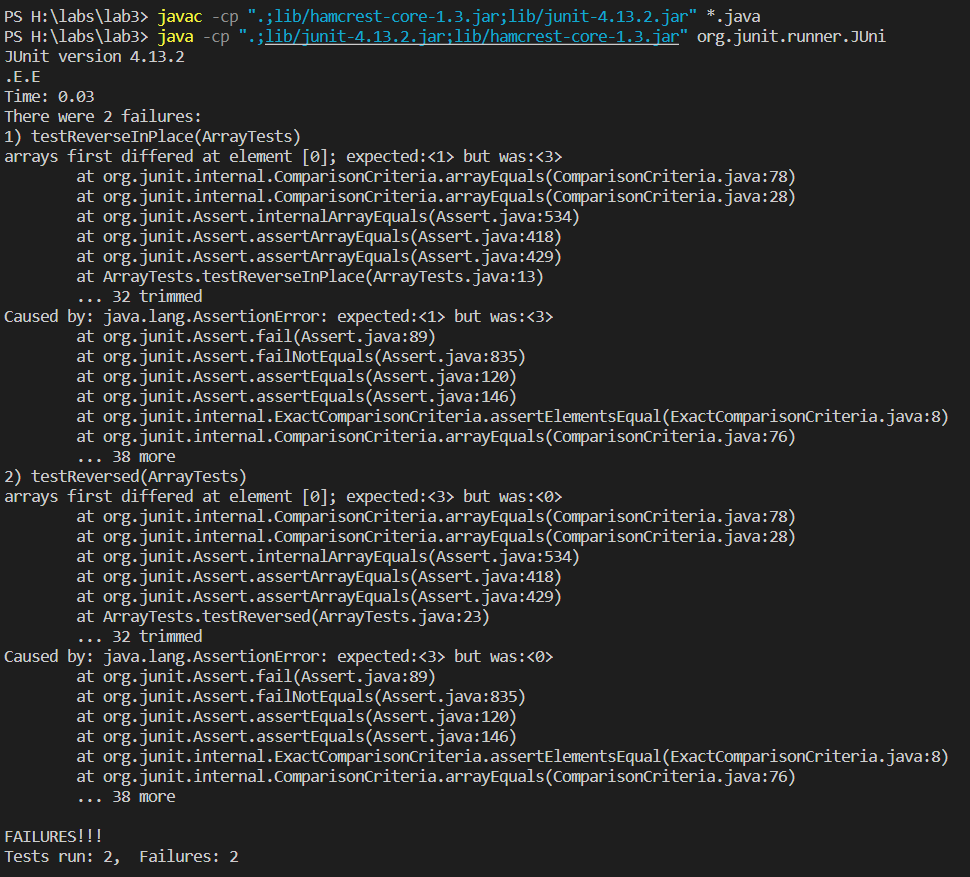

# Week 3 Lab Report
## Part 1

Show the code for your Simplest Search Engine from week 2 (use a code block in Markdown). Then, show three screenshots of using it including at least one add and one query, showing the URL in the browser and the response on the page.

For each screenshot, describe:

Which methods in your code are called
What the values of the relevant arguments to those methods are, and the values of any relevant fields of the class
If those values change, how they change by the time the request is done processing

## Part 2

For the second part of lab, my group and I worked on running tests for the ArrayExamples file. Using the base code given we ran the JUnit test and both passed

This lead me to setup some failure-inducing inputs to test most cases below is an image of the setup for both ReverseInPlace and Reversed commands.

The symptom of the failure inducing input was both tests failing as seen below:

So, once the bug was found in both codes I was able to find a solution with my group and we came up with the following code:

Before 

Then, explain the connection between the symptom and the bug. Why does the bug cause that particular symptom for that particular input?
